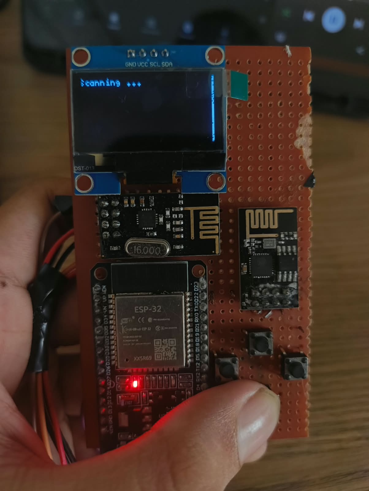

# M3du5a

**ESP32-based portable WiFi tool** with OLED interface, currently focused on WiFi scanning & deauthentication, with planned nRF24 support.

> **Status**: Work in progress. Core scanning + menu system is working. Attack features and nRF24 integration are still under development.

  


---

## Features (Current)

- 128×64 SSD1306 OLED menu system
- WiFi network scanning (SSID, BSSID, Channel, RSSI)
- Random MAC address spoofing on boot
- 4-button navigation (Select / Back / Up / Down)
- Modular C++ architecture (`Display`, `Buttons`, `WiFi_Utils`, `Mainwindow`)
- Deauth packet transmission function ready (UI not fully wired yet)

## Planned Features

- nRF24L01+ integration (scanning / analysis / other 2.4 GHz tools)
- Full Attack menu implementation
- SK6812 / WS2812 status LED
- Battery + charging support
- Additional RF modules

---

## Hardware

| Component              | Details                          | Pins / Notes                  |
|------------------------|----------------------------------|-------------------------------|
| MCU                    | ESP32 DevKit                     | —                             |
| Display                | 0.96" SSD1306 OLED (I2C)         | SDA = GPIO 22, SCL = GPIO 21  |
| Buttons                | 4 × tactile (INPUT_PULLUP)       | SEL=12, BACK=4, UP=26, DOWN=19 |
| RGB LED (planned)      | SK6812 / WS2812                  | Data = GPIO 5                 |
| nRF24L01+ (planned)    | Not yet connected                | Female headers ready          |
| Board                  | Red perforated protoboard        | Point-to-point wiring         |

### Pin Summary
```
OLED:
  VCC  → 3.3V
  GND  → GND
  SDA  → GPIO 22
  SCL  → GPIO 21

Buttons (other side → GND):
  Select → GPIO 12
  Back   → GPIO 4
  Up     → GPIO 26
  Down   → GPIO 19

SK6812 (planned):
  Data → GPIO 5
```

---

## Software Structure

```
main/
├── esp32_wifi_deauther.ino   # Entry point
├── mainwindow.h / .cpp       # UI state machine & menu logic
├── display.h / .cpp          # U8g2 OLED wrapper
├── buttons.h / .cpp          # Debounced button reading
└── wifi_utils.h / .cpp       # Scan, MAC spoof, deauth, port scan helpers
```

### Menu Flow
1. **Main** → Select / Scan & Information / Attack / Info
2. **Scan & Information** → List networks + detailed view (SSID/BSSID/Channel/RSSI) + Rescan
3. **Attack** → (not implemented yet)
4. **Info** → Version + MAC address

---

## Building & Flashing

### Requirements
- Arduino IDE or PlatformIO
- ESP32 board support
- Libraries:
  - `U8g2` (by olikraus)
  - ESP32 core (WiFi, esp_wifi)

### Arduino IDE
1. Select board: **ESP32 Dev Module**
2. Open `main/esp32_wifi_deauther.ino`
3. Install **U8g2** library
4. Upload

### PlatformIO (recommended)
```ini
[env:esp32dev]
platform = espressif32
board = esp32dev
framework = arduino
lib_deps =
    olikraus/U8g2
```

---

## Current Limitations

- Attack menu is empty (deauth function exists in `wifi_utils` but is not called from UI yet)
- nRF24 not connected / not coded
- No battery management
- Simple blocking button reading (no long-press / multi-press yet)

---

## Roadmap

- [done] OLED + button menu system
- [done] WiFi scanning + detailed info
- [done] Random MAC
- [ ] Finish Attack page (deauth UI)
- [ ] Add nRF24L01 support
- [ ] SK6812 status LED
- [ ] Better power management / battery
- [ ] Cleaner schematic + PCB version

---

## Credits & Inspiration

Original menu/UI structure inspired by various open-source ESP32 deauther projects.  
Hardware is a custom protoboard build.

---

## License

This project is for **educational and research purposes only**.  
Use responsibly and only on networks you own or have explicit permission to test.

---

**Author**: B15AL  
**Repo**: https://github.com/B15AL/M3du5a
